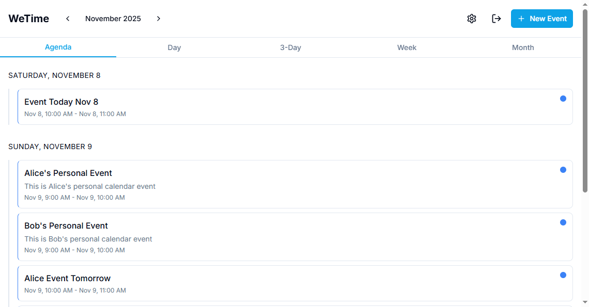

# WeTime – Couples Calendar

A beautiful, mobile-first PWA for couples to manage shared calendars, sync external iCal feeds, and coordinate schedules together.



## Features

- 📅 **Multiple Calendar Views**: Agenda (default on mobile), Day, 3-Day, Week, and Month views
- 👥 **Couple Pairing**: Create or join a couple with invite codes
- 🔗 **External Calendars**: Sync public iCal URLs (no OAuth required)
- 📤 **ICS Import**: Upload `.ics` files to import events
- 🔄 **Auto-Refresh**: External calendars refresh every 15 minutes
- 🔔 **Notifications**: Email and web notifications for event reminders
- 📧 **Email Reminders**: Configurable SMTP settings per user
- ⚙️ **Notification Preferences**: Customizable reminder times and channels
- 🎨 **Beautiful UI**: Mobile-first design with light/dark themes
- 📱 **PWA**: Installable on iOS/Android with offline support
- 🔒 **Secure**: Self-signed SSL, CSRF protection, rate limiting

## Screenshots

### Login Page


### Signup Page


### Main Calendar Views

**Agenda View** (default on mobile):


**Day View**:


**3-Day View**:


**Week View**:


**Month View**:


### Event Editor


### Calendar Management


### Settings


### Admin Panel

**Main Admin Panel**:


**Users Tab**:


**Calendars Tab**:


**Events Tab**:


**Couples Tab**:


**Cleanup Tab**:


## Quick Start

### Prerequisites

- Docker & Docker Compose (v3+)
- Node.js 18+ (for local development)

### Setup

1. **Clone and configure**:
   ```bash
   cp .env.example .env
   # Edit .env and set your secrets (JWT_SECRET, COOKIE_SECRET, INTERNAL_CRON_TOKEN)
   ```

2. **Start the stack**:
   ```bash
   docker compose up -d --build
   ```

3. **Seed demo data** (optional):
   ```bash
   make seed
   # Or: SEED=1 docker compose up -d --build backend
   ```

4. **Access the app**:
   - Frontend: https://localhost (accept self-signed certificate warning)
   - API: https://localhost/api

### Demo Accounts

After seeding:
- **Alice**: alice@example.com / password123
- **Bob**: bob@example.com / password123
- **Couple Code**: DEMO1234

## Architecture

### Services

- **`db`**: PostgreSQL 16 (persisted in `dbdata` volume)
- **`backend`**: Next.js API routes on port 3001 (internal)
  - Auto-runs Prisma migrations on startup
  - Handles auth, calendars, events, SMTP settings
- **`frontend`**: Next.js 15 app on port 3000 (internal)
  - PWA with service worker
  - Mobile-first responsive design
- **`worker`**: Background cron service
  - Refreshes external ICS feeds every 15 minutes
  - Sends email reminders every minute
- **`nginx`**: Reverse proxy with self-signed SSL
  - HTTP → HTTPS redirect
  - Proxies `/` → frontend, `/api/` → backend
  - Serves PWA static assets with caching

### Network

All services run on a user-defined bridge network (`wetime_net`). Only nginx exposes ports 80/443.

## Development

### Local Development (without Docker)

```bash
# Install dependencies
pnpm install

# Setup database (requires local Postgres)
cp .env.example .env
# Update DATABASE_URL to point to local Postgres

# Generate Prisma client
cd apps/backend && npx prisma generate

# Run migrations
npx prisma migrate dev

# Start services
pnpm dev  # Runs frontend (3000) and backend (3001) in parallel
```

### Make Commands

- `make up` - Build and start all services
- `make down` - Stop and remove volumes
- `make logs` - Follow logs from all services
- `make seed` - Seed demo data

## API Endpoints

### Authentication
- `POST /api/auth/signup` - Create account
- `POST /api/auth/login` - Sign in
- `POST /api/auth/logout` - Sign out

### Couples
- `POST /api/couple/create` - Create couple, get invite code
- `POST /api/couple/join` - Join couple with code

### Calendars
- `GET /api/calendars` - List user's calendars
- `POST /api/calendars` - Create calendar (PERSONAL/SHARED/EXTERNAL)
- `PATCH /api/calendars/:id` - Update calendar
- `DELETE /api/calendars/:id` - Delete calendar
- `POST /api/calendars/:id/refresh` - Refresh external calendar
- `POST /api/calendars/import` - Import .ics file (multipart/form-data)
- `GET /api/calendars/:id/export.ics` - Export calendar as iCal

### Events
- `GET /api/events?rangeStart=&rangeEnd=` - List events in range
- `POST /api/events` - Create event
- `PATCH /api/events/:id` - Update event
- `DELETE /api/events/:id` - Delete event
- `POST /api/events/:id/attend` - RSVP to event

### Settings
- `GET /api/settings/smtp` - Get SMTP settings
- `POST /api/settings/smtp` - Save SMTP settings
- `POST /api/settings/smtp/test` - Send test email
- `GET /api/settings/notifications` - Get notification preferences
- `POST /api/settings/notifications` - Update notification preferences

### Notifications
- `GET /api/notifications` - List notifications (with read filter and limit)
- `PATCH /api/notifications` - Mark notification as read/unread
- `DELETE /api/notifications?id=` - Delete notification

### Internal (Worker)
- `POST /api/internal/cron/refresh-ics` - Refresh all external calendars
- `POST /api/internal/cron/send-reminders` - Send email reminders

## Data Model

See `prisma/schema.prisma` for the complete schema. Key models:

- **User**: Email/password auth, timezone, couple pairing
- **Couple**: Two users linked via invite code, shared calendar
- **Calendar**: PERSONAL, SHARED, EXTERNAL, or IMPORTED
- **Event**: Title, dates (UTC), recurrence (RRULE), visibility
- **Attendee**: RSVP status for shared events
- **SmtpSetting**: Encrypted per-user email configuration
- **Notification**: Web notifications for event reminders
- **NotificationPreference**: User notification preferences and settings
- **EventReminder**: Tracks sent reminders to prevent duplicates

## Security

- **HTTPS**: Self-signed certificates (auto-generated on first run)
- **CSRF**: Token validation on mutating routes
- **Rate Limiting**: Per-IP and per-user limits
- **Secure Cookies**: HttpOnly, SameSite=Lax, Secure
- **Password Hashing**: bcrypt with salt rounds

## Troubleshooting

### Certificate Warnings

The app uses self-signed SSL certificates. Browsers will show a warning. Click "Advanced" → "Proceed to localhost" to continue.

### Database Connection Issues

Ensure the `DATABASE_URL` in `.env` matches the docker-compose service name:
```
DATABASE_URL=postgresql://wetime:wetime_password@db:5432/wetime
```

### Port Conflicts

If ports 80/443 are in use, modify `docker-compose.yml` to use different ports.

### Reset Everything

```bash
make down  # Stops and removes volumes
docker compose up -d --build  # Fresh start
make seed  # Re-seed data
```

## Documentation

Comprehensive documentation is available in the [`docs/`](docs/) directory:

- **[Architecture](docs/ARCHITECTURE.md)** - System architecture and component overview
- **[API Documentation](docs/API.md)** - Complete REST API reference
- **[Frontend Guide](docs/FRONTEND.md)** - Frontend components and structure
- **[Database Schema](docs/DATABASE.md)** - Database schema documentation
- **[Deployment Guide](docs/DEPLOYMENT.md)** - Production deployment instructions
- **[Development Guide](docs/DEVELOPMENT.md)** - Local development setup and workflow
- **[Security Documentation](docs/SECURITY.md)** - Security measures and best practices
- **[Administrator Guide](docs/ADMIN.md)** - Admin user creation and panel usage
- **[Notifications Guide](docs/NOTIFICATIONS.md)** - Notification system setup and usage

## License

MIT

