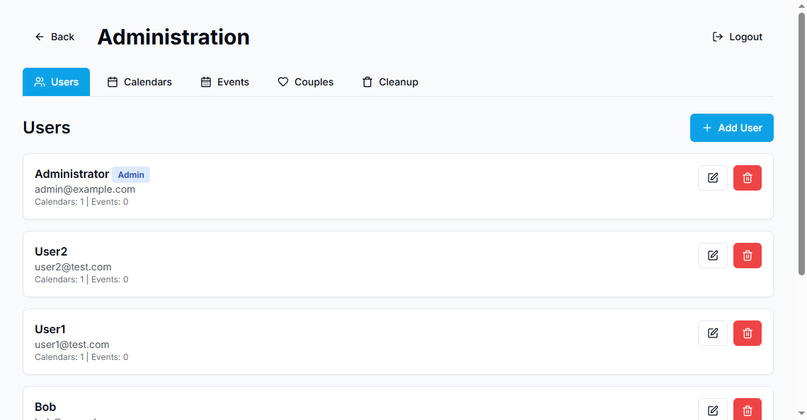
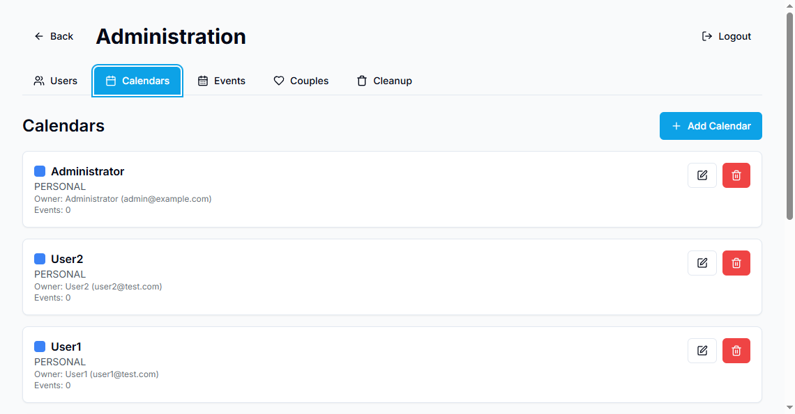
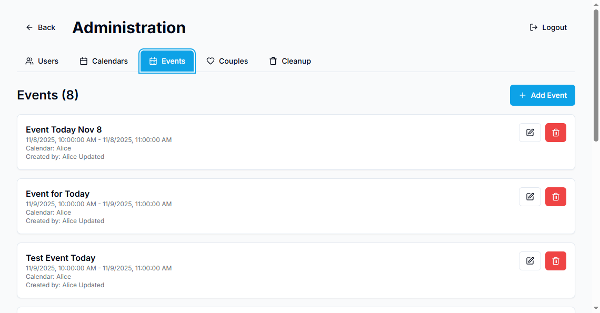
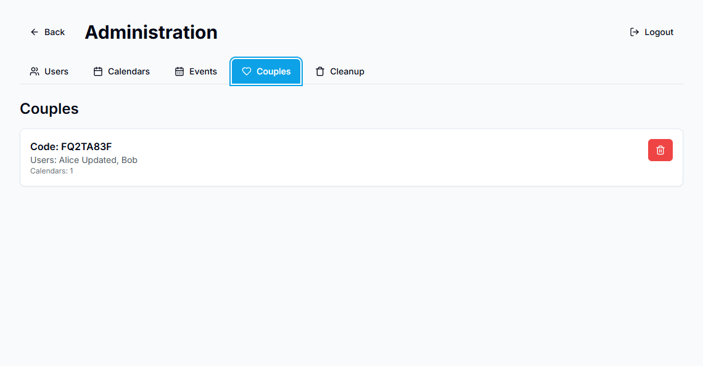
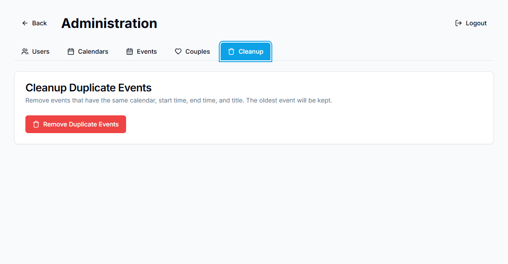

# Administrator Guide

This guide explains how to create and manage administrator users in the WeTime application.

## Overview

Administrator users have access to a special admin panel at `/admin` where they can:
- View and manage all users, calendars, events, and couples
- Clean up duplicate events
- Create, edit, and delete any entity in the system

## Creating an Admin User

There are several ways to create an administrator user:

### Method 1: Using the Create Admin Script (Recommended)

The easiest way to create an admin user is using the provided script.

#### Using Docker (Recommended for Production)

**Quick Method (Using Node directly):**

```bash
# Create a simple script file
cat > create-admin-simple.js << 'EOF'
const bcrypt = require('bcrypt');
const { PrismaClient } = require('@prisma/client');
const prisma = new PrismaClient();
(async () => {
  const hash = await bcrypt.hash('admin123456', 10);
  const user = await prisma.user.upsert({
    where: { email: 'admin@example.com' },
    update: { isAdmin: true },
    create: { email: 'admin@example.com', passwordHash: hash, name: 'Administrator', isAdmin: true, timeZone: 'America/New_York' }
  });
  console.log('Admin created:', user.email);
  await prisma.$disconnect();
})();
EOF

# Copy and run it
docker compose cp create-admin-simple.js backend:/app/create-admin-simple.js
docker compose exec backend node create-admin-simple.js
rm create-admin-simple.js
```

**Using the TypeScript Script (if available):**

```bash
# Create admin with default credentials (admin@example.com / admin123456)
docker compose exec backend npm run create-admin

# Or with custom credentials using environment variables
docker compose exec backend sh -c "ADMIN_EMAIL=your-email@example.com ADMIN_PASSWORD=your-secure-password ADMIN_NAME='Your Name' npm run create-admin"
```

#### Using Local Development

```bash
cd apps/backend

# Create admin with default credentials
npm run create-admin

# Or with custom credentials
ADMIN_EMAIL=your-email@example.com ADMIN_PASSWORD=your-secure-password ADMIN_NAME='Your Name' npm run create-admin
```

**Default Credentials:**
- Email: `admin@example.com`
- Password: `admin123456`
- Name: `Administrator`

**⚠️ Security Note:** Change the default password immediately after first login!

### Method 2: Using the Admin API (Requires Existing Admin)

If you already have an admin user, you can create additional admin users through the admin API:

```bash
curl -X POST http://localhost/api/admin/users \
  -H "Content-Type: application/json" \
  -b "token=your-auth-cookie" \
  -d '{
    "email": "newadmin@example.com",
    "password": "secure-password-here",
    "name": "New Admin",
    "isAdmin": true
  }'
```

Or use the admin panel UI at `/admin` → Users tab → "Add User" button.

### Method 3: Direct Database Update

If you need to promote an existing user to admin, you can update the database directly:

```bash
# Using Docker
docker compose exec db psql -U wetime -d wetime -c "UPDATE \"User\" SET \"isAdmin\" = true WHERE email = 'user@example.com';"

# Or using Prisma Studio
docker compose exec backend npx prisma studio
# Then navigate to User table and edit the isAdmin field
```

### Method 4: Using Prisma Migrate/Seed

You can also add admin users in your seed script or migration:

```typescript
const admin = await prisma.user.create({
  data: {
    email: 'admin@example.com',
    passwordHash: await hashPassword('secure-password'),
    name: 'Administrator',
    isAdmin: true,
  },
});
```

## Accessing the Admin Panel

1. Log in with your admin credentials at `/login`
2. Navigate to `/admin` in your browser
3. You should see the admin panel with tabs for:
   - **Users**: Manage all users
   - **Calendars**: View and manage all calendars
   - **Events**: View and manage all events
   - **Couples**: View and manage couples
   - **Cleanup**: Remove duplicate events



**Admin Panel Tabs:**

- **Users Tab**:
  

- **Calendars Tab**:
  

- **Events Tab**:
  

- **Couples Tab**:
  

- **Cleanup Tab**:
  

> **Note**: Additional screenshots are available in the main README.md file.

## Admin Panel Features

### Users Management
- View all users with their email, name, and admin status
- Create new users (including admin users)
- Edit user details (email, name, timezone, admin status)
- Change user passwords
- Delete users (cascades to their calendars and events)

### Calendars Management
- View all calendars across all users
- See calendar owners and associated couples
- Create new calendars for any user or couple
- Edit calendar properties (name, color, ICS URL)
- Delete calendars (cascades to events)

### Events Management
- View all events with pagination
- See event details including calendar and creator
- Create new events
- Edit event properties
- Delete events

### Couples Management
- View all couples and their members
- See associated shared calendars
- Delete couples (unlinks users)

### Cleanup Tools
- **Remove Duplicate Events**: Automatically removes events that have the same:
  - Calendar ID
  - Start time
  - End time
  - Title
  
  The oldest event is kept, and duplicates are deleted.

## Security Best Practices

1. **Change Default Passwords**: Always change default admin passwords immediately
2. **Use Strong Passwords**: Admin accounts should use strong, unique passwords
3. **Limit Admin Access**: Only grant admin privileges to trusted users
4. **Regular Audits**: Periodically review admin users and remove unnecessary privileges
5. **Secure Environment Variables**: When using environment variables for admin creation, ensure they're not logged or exposed

## Troubleshooting

### "Admin access required" Error

If you see this error when accessing `/admin`:
- Verify the user's `isAdmin` field is set to `true` in the database
- Log out and log back in to refresh your session
- Check that you're using the correct user account

### Cannot Create Admin User

If the create-admin script fails:
- Ensure the database is running: `docker compose ps`
- Check database connection: `docker compose exec backend npx prisma db push`
- Verify Prisma client is generated: `docker compose exec backend npx prisma generate`

### Admin Panel Not Loading

If the admin panel doesn't load:
- Check browser console for errors
- Verify backend is running: `docker compose ps`
- Check backend logs: `docker compose logs backend`
- Ensure frontend is built with latest changes: `docker compose build frontend`

## API Endpoints

All admin endpoints require authentication and admin privileges:

- `GET /api/admin/users` - List all users
- `POST /api/admin/users` - Create user
- `PATCH /api/admin/users/[id]` - Update user
- `DELETE /api/admin/users/[id]` - Delete user
- `GET /api/admin/calendars` - List all calendars
- `POST /api/admin/calendars` - Create calendar
- `PATCH /api/admin/calendars/[id]` - Update calendar
- `DELETE /api/admin/calendars/[id]` - Delete calendar
- `GET /api/admin/events` - List all events
- `POST /api/admin/events` - Create event
- `PATCH /api/admin/events/[id]` - Update event
- `DELETE /api/admin/events/[id]` - Delete event
- `GET /api/admin/couples` - List all couples
- `DELETE /api/admin/couples?id=[id]` - Delete couple
- `POST /api/admin/cleanup-duplicates` - Remove duplicate events

## Support

For issues or questions about admin functionality, please check:
- Application logs: `docker compose logs backend`
- Database status: `docker compose ps db`
- Prisma migrations: `docker compose exec backend npx prisma migrate status`

