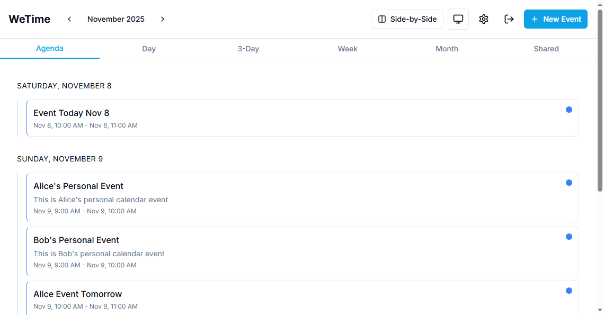
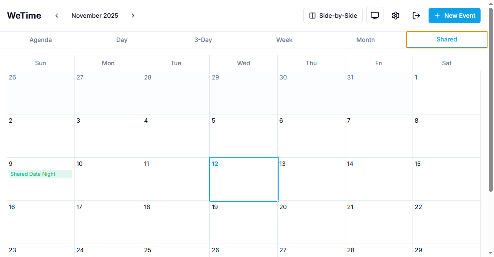
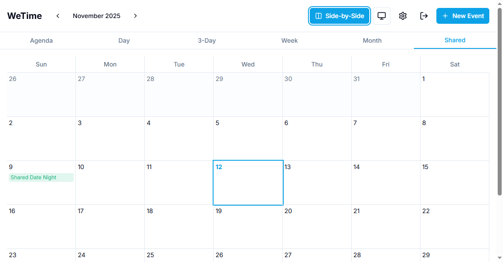

# WeTime Features Documentation

## Screenshots

### Initial Page View

The main calendar page showing the side-by-side toggle button and view tabs.

### Shared Calendar Tab

The dedicated "Shared" tab displaying only shared calendar events in month view.

### Side-by-Side View

The side-by-side calendar view showing both users' calendars in separate columns.

## Side-by-Side Calendar View

### Overview
The side-by-side calendar view allows couples to view each other's calendars simultaneously in separate columns, making it easy to see what's happening in each other's schedules.

### Features

#### 1. Toggle Button
- **Location**: Header bar, next to Settings and Logout buttons
- **Visibility**: Only appears when user is in a couple (has a partner)
- **Icon**: Columns icon (two vertical columns)
- **Behavior**: Toggles between combined view and side-by-side view
- **Persistence**: Preference is saved to localStorage

#### 2. Side-by-Side Mode
When enabled, the calendar displays two columns:
- **Left Column**: Current user's events
- **Right Column**: Partner's events
- **Column Headers**: Display user names for easy identification
- **Shared Events**: Events from shared calendars or with `visibility='partner'` appear in both columns with dashed borders

#### 3. Supported Views
Side-by-side mode works across all calendar views:
- **Day View**: Two columns showing hourly schedules
- **Week View**: Two columns showing weekly schedules
- **Month View**: Two columns showing monthly grid
- **3-Day View**: Each day shows side-by-side columns
- **Agenda View**: Two columns showing event lists

#### 4. Event Filtering
Events are categorized based on:
- **Primary**: Calendar owner (`calendar.ownerId`)
- **Secondary**: Event creator (`event.createdById`)
- **Shared**: Events from shared calendars (no `ownerId`, has `coupleId`) or events with `visibility='partner'`

### Technical Implementation

#### Frontend Changes
- **Main Page** (`apps/frontend/src/app/page.tsx`):
  - Added side-by-side toggle state management
  - Fetches user profile and partner information
  - Passes side-by-side props to all view components

- **View Components**:
  - `DayView`: Renders two columns with hour markers
  - `WeekView`: Renders two columns with day headers
  - `MonthView`: Renders two columns with calendar grids
  - `AgendaView`: Renders two columns with event lists

- **Utility Function** (`apps/frontend/src/lib/utils.ts`):
  - `filterEventsByOwner()`: Separates events by owner/creator

#### Backend Changes
- **Events API** (`apps/backend/src/app/api/events/route.ts`):
  - Enhanced to include calendar owner information in responses
  - Includes `ownerId`, `coupleId`, and `type` for proper filtering

## Shared Calendar Tab

### Overview
A dedicated "Shared" tab that displays only shared calendar events in month view format.

### Features

#### 1. Shared Tab
- **Location**: View tabs (Agenda, Day, 3-Day, Week, Month, **Shared**)
- **Visibility**: Only appears when user is in a couple
- **View Type**: Month view format
- **Content**: Shows only events from:
  - Shared calendars (calendars with `coupleId` and no `ownerId`)
  - Events with `visibility='partner'`

#### 2. Navigation
- Month navigation (prev/next) works in shared view
- Clicking a day switches to day view
- Date range calculation optimized for month view

### Technical Implementation

#### Frontend Changes
- **Main Page** (`apps/frontend/src/app/page.tsx`):
  - Added `'shared'` to View type
  - Added shared tab to view tabs (conditional on `hasCouple`)
  - Added shared view rendering with filtered events
  - Updated date range and navigation functions

## Shared Events Display

### Overview
Shared events are displayed in both users' calendars when side-by-side mode is enabled, making it clear which events both members are attending.

### Features

#### 1. Visual Distinction
- **Dashed Borders**: Shared events use dashed borders instead of solid
- **Both Columns**: Shared events appear in both user columns
- **Color Coding**: Events maintain their calendar color

#### 2. Event Types Considered Shared
- Events from shared calendars (type='SHARED')
- Events with `visibility='partner'` (visible to partner)

### Technical Implementation

#### Filtering Logic
The `filterEventsByOwner()` function identifies shared events by:
1. Checking if calendar is shared (`coupleId` set, no `ownerId`)
2. Checking if event has `visibility='partner'`
3. Adding these events to the `sharedEvents` array
4. Including them in both user columns when rendering

## Usage Instructions

### Enabling Side-by-Side View
1. Ensure you are part of a couple (have a partner linked)
2. Click the "Side-by-Side" button in the header
3. The calendar will split into two columns
4. Your preference is saved and will persist across sessions

### Viewing Shared Calendar
1. Ensure you are part of a couple
2. Click the "Shared" tab in the view tabs
3. Only shared calendar events will be displayed
4. Navigate months using prev/next buttons
5. Click any day to switch to day view

### Creating Shared Events
1. Create an event in a shared calendar, OR
2. Set event visibility to "partner" when creating/editing an event
3. The event will appear in both users' calendars in side-by-side mode

## Browser Compatibility
- Modern browsers (Chrome, Firefox, Safari, Edge)
- Responsive design (columns stack on mobile devices)

## Future Enhancements
- Option to show shared events in a middle column
- Toggle to show/hide shared events in side-by-side view
- Different visual indicators for different event types

## AI Assistant

### Overview
The AI Assistant is an intelligent calendar assistant powered by Ollama that allows users to interact with their calendar using natural language. Users can ask questions about their schedule, view upcoming events, and create new events through conversational chat.

### Features
- **Natural Language Queries**: Ask questions about your calendar in plain English
- **Schedule Viewing**: Query upcoming events, today's schedule, or events for specific dates
- **Event Creation**: Create new calendar events through conversation
- **Date Awareness**: The AI understands current date/time and distinguishes between past and future events
- **Calendar Integration**: Fully integrated with your existing calendars and events

### Usage
1. Configure Ollama settings in Settings → AI Assistant
2. Click the chat button in the bottom-right corner of the calendar page
3. Ask questions or create events using natural language

For detailed setup and usage instructions, see [AI Assistant Documentation](./AI_ASSISTANT.md).

## Notifications

### Overview
The notification system provides email and web notifications for event reminders, helping couples stay informed about upcoming events. Users can configure reminder times, choose notification channels, and manage notifications through an intuitive notification center.

### Features
- **Email Notifications**: Send email reminders via configurable SMTP settings
- **Web Notifications**: In-app notification center with real-time updates
- **Customizable Reminders**: Set reminder times (e.g., 15 minutes, 1 hour, 1 day before events)
- **Notification Preferences**: Toggle email and web notifications independently
- **Event-Specific Reminders**: Override default reminder times per event
- **Unread Badge**: Visual indicator showing unread notification count
- **Auto-Polling**: Notifications automatically refresh every 30 seconds

### Usage
1. Configure notification preferences in Settings → Notifications
2. Set up SMTP settings in Settings → SMTP Settings (for email notifications)
3. Set reminder time (minutes before event) or disable reminders
4. Toggle email and web notifications on/off
5. View notifications via the bell icon in the header
6. Mark notifications as read or delete them from the notification dropdown

For detailed setup and usage instructions, see [Notifications Documentation](./NOTIFICATIONS.md).
