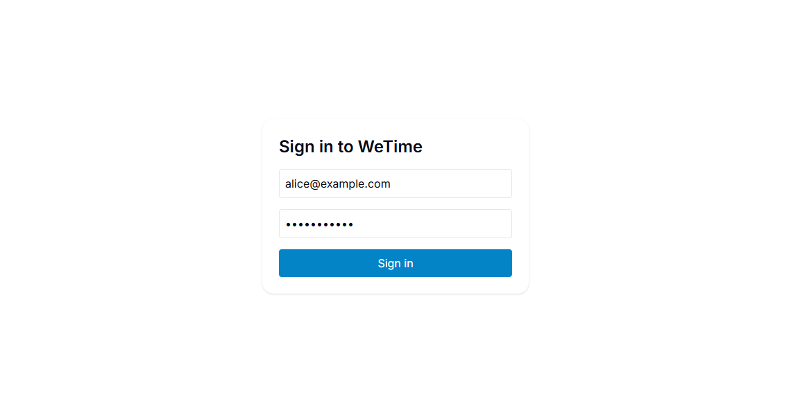
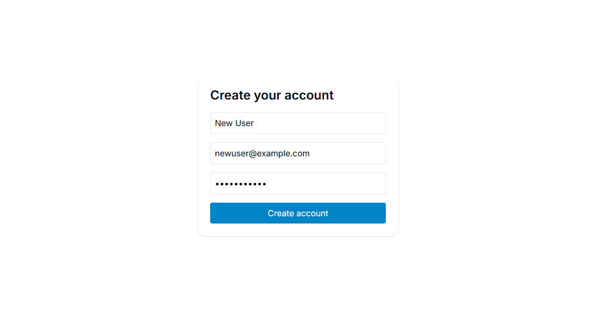
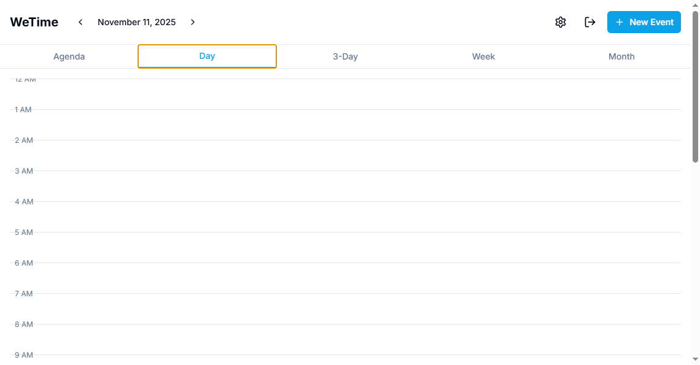
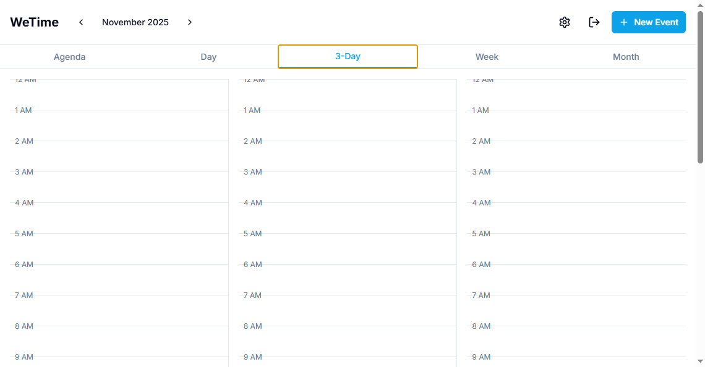
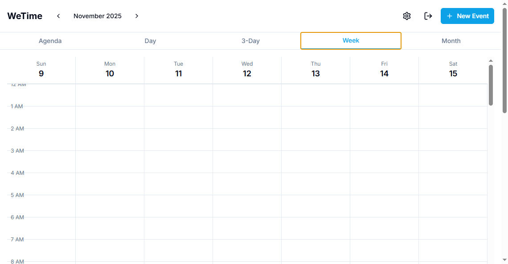
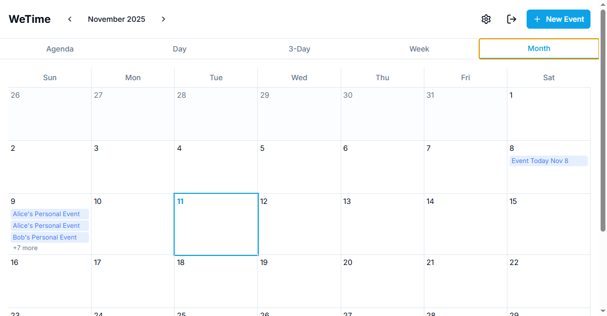
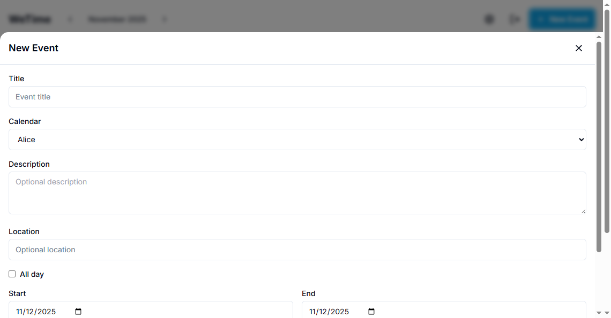

# WeTime Documentation

Welcome to the WeTime documentation. This directory contains comprehensive guides and references for using, developing, and managing the WeTime application.

## Documentation Index

### Getting Started
- **[Main README](../README.md)** - Quick start guide and overview
- **[Development Guide](./DEVELOPMENT.md)** - Local development setup and workflow
- **[Deployment Guide](./DEPLOYMENT.md)** - Production deployment instructions

### Architecture & Design
- **[Architecture Documentation](./ARCHITECTURE.md)** - System architecture, components, and data flow
- **[Database Schema](./DATABASE.md)** - Complete database schema documentation
- **[Frontend Documentation](./FRONTEND.md)** - Frontend components, pages, and structure
- **[API Documentation](./API.md)** - Complete REST API reference

### Administration
- **[Administrator Guide](./ADMIN.md)** - Admin user creation and panel usage
- **[Security Documentation](./SECURITY.md)** - Security measures, best practices, and vulnerabilities

## Screenshots

The application includes several key pages and features:

### Authentication

**Login Page**:


**Signup Page**:


### Calendar Views

**Agenda View** (default on mobile):


**Day View**:


**3-Day View**:


**Week View**:


**Month View**:


### Event Management

**Event Editor**:


### Calendar Management

**Calendar Management Page**:


### Settings

**Settings Page**:


### Admin Panel

**Admin Panel - Users Tab**:


**Admin Panel - Calendars Tab**:


**Admin Panel - Events Tab**:


**Admin Panel - Couples Tab**:


**Admin Panel - Cleanup Tab**:


See the [Frontend Documentation](./FRONTEND.md) and [Administrator Guide](./ADMIN.md) for more detailed information about each page.

## Quick Start

### Creating Your First Admin User

```bash
# Using Docker (recommended)
docker compose exec backend npm run create-admin

# Default credentials:
# Email: admin@example.com
# Password: admin123456
```

Then log in at `https://localhost/login` and navigate to `https://localhost/admin`.

### Development Setup

See the [Development Guide](./DEVELOPMENT.md) for detailed setup instructions.

### Production Deployment

See the [Deployment Guide](./DEPLOYMENT.md) for production deployment steps.

## Documentation by Role

### For Developers
- [Development Guide](./DEVELOPMENT.md) - Setup and workflow
- [Architecture Documentation](./ARCHITECTURE.md) - System design
- [Frontend Documentation](./FRONTEND.md) - Frontend development
- [API Documentation](./API.md) - API reference
- [Database Schema](./DATABASE.md) - Database structure

### For Administrators
- [Administrator Guide](./ADMIN.md) - Admin panel usage
- [Deployment Guide](./DEPLOYMENT.md) - Production deployment
- [Security Documentation](./SECURITY.md) - Security best practices

### For Users
- [Main README](../README.md) - User-facing features and setup

## Additional Resources

- Main README: [../README.md](../README.md)
- Repository Guidelines: [../AGENTS.md](../AGENTS.md)


